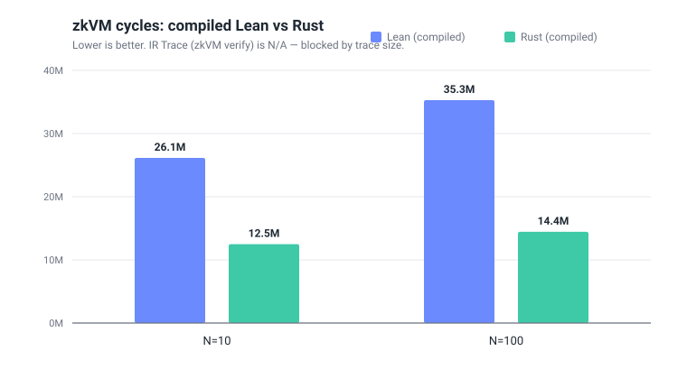
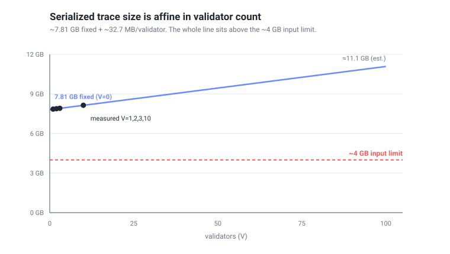
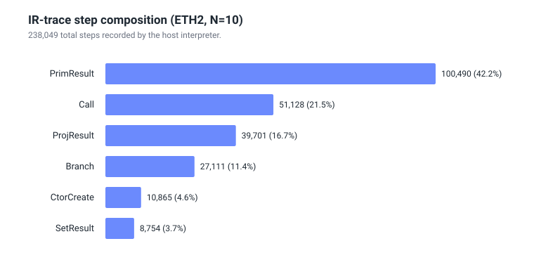
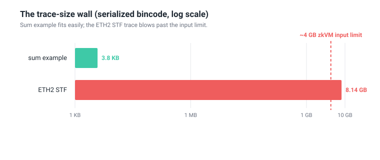

<!-- ethresear.ch post body starts below. Do NOT paste the YAML frontmatter above
     into Discourse — it is repo metadata only and will not render. Copy from the
     H1 heading onward. Replace [link to repo] before posting.

     Figures are SVGs in docs/assets/. On GitHub the relative image links render
     as-is. For ethresear.ch, upload each figure to the post (if your Discourse
     instance rejects SVG uploads, export the SVG to PNG first — e.g. open it in
     a browser and "Save as", or run `rsvg-convert in.svg -o out.png`) and swap
     the image links for the uploaded URLs. -->

# Verifying a Lean-specified Ethereum STF in a zkVM by interpreting IR and proving the trace

## TL;DR

- We wrote an Ethereum consensus **state transition function (STF) in Lean 4** and explored three ways to get a zk proof of its execution inside a RISC Zero zkVM: compile Lean→RISC-V, compile Rust→RISC-V (baseline), and a third **"IR Trace"** approach that needs no Lean→RISC-V toolchain.
- In the **IR Trace** approach the host *interprets* Lean's lambda-RC (λRC) IR and records an execution trace; the zkVM guest is a tiny program that **re-checks each trace step**.
- For the real ETH2 STF, **host-side trace generation completes**, but the serialized trace is **affine in validator count: ~7.8 GB fixed + ~33 MB per validator** (measured: 7.85 GB at V=1, 8.14 GB at V=10). The **fixed term alone already exceeds the ~4 GB input-path limit** we hit — so even a *single*-validator proof is blocked today, and at mainnet validator counts the per-validator term explodes into the TB range. The ETH2 STF has thus **not** been executed or proven in-guest.
- We're sharing the numbers and the wall we hit, and **asking for feedback** on trace-compression directions (and on whether interpret-then-verify is the right shape at all).

> Note on terminology: below, "the host generated a trace" means trace generation ran to completion on the host. It does **not** imply the trace was verified — for ETH2 the in-guest verifier has not run.

## Motivation

The Ethereum consensus spec is the kind of artifact you'd love to write in a proof assistant: precise semantics, machine-checkable invariants. Lean 4 is attractive for that. The question we started from: **if the STF is written in Lean, how do we get a succinct proof that a given pre-state + block produced a given post-state?**

The obvious route is to run the STF inside a zkVM. But getting Lean *into* a RISC-V zkVM guest is heavy: you either compile Lean→C→RISC-V (and drag in the Lean runtime + `Init`), or you re-implement the STF in a zkVM-friendly language and lose the link to the Lean spec.

So we asked: **can we avoid compiling Lean to RISC-V entirely?** Lean already lowers programs to a small IR (lambda-RC). What if we interpret that IR *on the host*, emit a structured execution trace, and make the zkVM guest a small **trace checker** instead of a full language runtime? That is the IR Trace approach.

## The three approaches

| Approach | What runs in the guest |
|----------|------------------------|
| **Compiled Lean → RISC-V** | The full STF + Lean runtime + `Init` (~15M cycles of init alone) |
| **Compiled Rust → RISC-V** | A hand-written Rust STF (baseline) |
| **IR Trace** (focus of this post) | A tiny checker that re-verifies a host-generated execution trace |

The IR Trace pipeline is one-directional:

```
Lean 4 STF
   │  dump lambda-RC IR  →  ir_program.json
   ▼
host interpreter  ──  interprets IR on the input, records every step  →  trace (bincode)
   ▼
host driver  ──  hashes IR + input, feeds {ir_hash, input, trace} to the zkVM
   ▼
zkVM guest  ──  re-verifies each trace step, commits the output hash
```

## What the guest actually checks

The trace is a flat **value table** (every intermediate value, referenced by index) plus a list of **steps**, wrapped in a header carrying SHA-256 hashes of the IR program, the input, and the output. Before trusting anything, the guest asserts those three hashes match, binding the proof to a specific program + input + output.

The verifier re-checks trace steps as follows:

- **Fully re-checked against the value table:** `PrimResult` (primitive ops), `CtorCreate` (constructor cells), `ProjResult` (field projection), `SetResult` (the `Set` field-update op), and `Branch` (the chosen constructor tag matches the scrutinee).
- **Function calls are *not* trusted as black boxes:** a user-function `Call` is represented by its inlined sub-steps in the trace, which are themselves checked. (Subject to the trace-coverage caveats below — we deliberately avoid calling this "sound" without qualification.)
- **Extern crypto stubs are trusted as axioms:** `hashTreeRoot`, `blsVerify`, etc. are accepted at their recorded results and not re-executed.

**What is being proven, precisely:** the proof binds the IR-program hash, the input hash, the output hash, and the checked trace semantics above. It does **not** establish equivalence to Lean's own runtime, and it does **not** establish correctness of the stubbed crypto. The trust boundary is exactly the set of extern stubs plus the trace-coverage gaps described in "Honest caveats."

## Benchmark results

A caveat up front: **the three approaches do not share a single cost metric.** Only the *workload* and the *output* are directly comparable across all three; zkVM cycles exist only for the compiled approaches, and the host-interpreter statistics exist only for IR Trace. So we report in three buckets rather than one misleading table.

### 1. Common axis — workload and output size (all three)

All three run the **same Lean-specified ETH2 STF on the same inputs** (N=10 and N=100 validators). The only directly-comparable *result* is the serialized output size:

| Output size | N=10 | N=100 |
|-------------|------|-------|
| Lean (compiled) | 78,746 B | 91,976 B |
| Rust (compiled) | 78,746 B | 91,976 B |
| IR Trace | 78,522 B | 91,752 B |

IR Trace is **224 bytes smaller** at both N. We attribute this to a difference in the test-input serializer driving the interpreter versus the compiled guests, **not** to a divergence in the STF itself — but we flag it as not-yet-reconciled.

### 2. Compiled approaches only — zkVM cost

zkVM cycles and segments exist **only for the two compiled approaches**. IR Trace's ETH2 zkVM verification is **N/A — blocked by trace size** (see "The wall" below), so there is no apples-to-apples cycle figure for it on ETH2; do not read its absence as "fast."

| Approach | N=10 cycles | N=10 seg | N=100 cycles | N=100 seg |
|----------|-------------|----------|--------------|-----------|
| Lean (compiled, incl. `Init`) | 26,148,291 | 29 | 35,281,299 | 38 |
| Rust (compiled, baseline) | 12,491,509 | 13 | 14,446,747 | 15 |



### 3. IR Trace only — host-interpreter statistics

These have **no analogue** in the compiled guests: host wall-clock time, step counts, and serialized trace size from interpreting the IR — *not* zkVM cycles, and not to be compared with the cycle table above.

**Serialized trace size is affine in validator count.** We measured V=1,2,3 directly and cross-checked against V=10 and V=100:

| V (validators) | Serialized trace | Trace steps | Value-table entries | Output |
|---------------:|-----------------:|------------:|--------------------:|-------:|
| 1   | 7.85 GB              | 229,371 | 617,066 | 77,199 B |
| 2   | 7.88 GB              | 230,334 | 619,593 | 77,346 B |
| 3   | 7.91 GB              | 231,308 | 622,147 | 77,493 B |
| 10  | 8.14 GB              | 238,049 | 639,836 | 78,522 B |
| 100 | ≈11.1 GB (estimated) | 324,741 | 867,320 | 91,752 B |

(Trace **bytes** are measured at V=1,2,3,10; at V=100 we extrapolate the byte size — serializing a >10 GB trace just to weigh it is not worth it — but the step and value-table **counts** are measured at all five.)

A linear fit over V=1,2,3 splits every metric cleanly into a **fixed term plus a per-validator term**:

```
serialized trace  ≈   7.81 GB  +  32.7 MB  × V
trace steps       ≈   228,400  +     968   × V
value-table       ≈   614,500  +   2,540   × V    (entries)
output size       ≈    77,052  +     147   × V    (bytes)
```

The fit is tight: it predicts 8.14 GB and 238,080 steps at V=10, and it reproduces the V=10 and V=100 output sizes (78,522 B, 91,752 B) **exactly**. So the affine form holds from V=1 to V=100.



**This reframes the scaling.** It is **not** sub-linear — it is **affine with a dominant fixed term**, and that has two consequences:

- At the toy scales we can actually run (V ≤ 100), the **fixed term dominates** — it is ~96% of the trace at V=10 — and the fixed term **alone exceeds the ~4 GB input limit** (7.85 GB even at V=1). Reducing the validator set does *not* get us under the wall.
- At mainnet scale (~1M validators) the **per-validator term takes over**: 32.7 MB/validator extrapolates to **tens of TB**. Both terms are fatal without compression — the fixed term blocks even a single-validator proof today, and the linear term rules out realistic scale.

(Looking at only V=10→V=100 earlier suggested a mild "1.36×, sub-linear"; that ratio was just the huge fixed intercept swamping the linear term.)

**Step composition is roughly stable** (host interpreter, V=10, median of 3 runs):

```
Total steps:  238,049
  PrimResult:   100,490  (42.2%)   arithmetic
  Call:          51,128  (21.5%)
  ProjResult:    39,701  (16.7%)
  Branch:        27,111  (11.4%)
  CtorCreate:    10,865  ( 4.6%)
  SetResult:      8,754  ( 3.7%)
Wall time:    7.71s median
```



`PrimResult` (arithmetic) is the per-validator workhorse — it carries the steepest slope, so its share creeps up with V (41.3% at V=1 → 42.2% at V=10 → 48.5% at V=100). Everything else is dominated by the fixed term.

## The wall: trace size

The ETH2 STF generates a trace on the host, but we cannot feed it to the guest: the input path in this implementation serializes a `Vec<u8>` via `env::write()` with a **u32 length prefix**, and the host hits a `TryFromIntError` at ~4 GB.

> We state this as the **input-path limit observed in this implementation**, not as an authoritative RISC Zero spec figure.

The decisive point from the affine fit above is that the **fixed ~7.81 GB term alone is already past the ~4 GB limit**. Even at **V=1** the trace is **7.85 GB** (617,066 value-table entries) — so this is not a "too many validators" problem we can dodge by testing small; the wall is structural and present at the smallest possible input.



Why is the fixed term so large? The interpreter clones **every intermediate value** into the value table, and ETH2 intermediates include large `ByteArray`s (the beacon state is ~78 KB) and deeply nested `Object`s, many of them near-duplicates (e.g. a byte array modified at a single index becomes a full new copy). The bulk of these clones happen in the validator-count-independent skeleton of the STF, which is why the fixed term dominates. Switching the trace format from JSON (~15 GB) to bincode only bought ~1.8×, because the cost is dominated by serializing complex nested values, not by JSON syntax overhead. The per-validator term (~32.7 MB/validator) is the *same* cloning pathology applied to per-validator state — harmless at V=1 but catastrophic at mainnet's ~1M validators.

Contrast with **compiled Lean**: there, intermediates live in paged zkVM memory and are never serialized. IR Trace externalizes all computation to the host and must hand every intermediate result to the guest — which is exactly what blows up.

## Honest caveats

This is a research prototype; some gaps matter for soundness and we want to be upfront:

1. **Not a faithful port of Lean's runtime.** Values, the stack/frame model, and native/extern dispatch are a Rust re-implementation that approximates Lean semantics for this workload, not Lean's actual runtime.
2. **Crypto is stubbed and trusted** (`hashTreeRoot`, `blsVerify`, …), as noted above.
3. **Trace coverage is incomplete for in-place mutations.** Be careful here, because it's easy to overstate what's checked: the `Set` field-update op *does* emit a re-checked `SetResult` step. But the in-place mutation ops `USet` / `SSet` / `SetTag` are **executed by the interpreter yet emit no trace step today**, so they currently fall **outside** the verified set. Closing this gap is required before any ETH2 proof would be meaningful.

## Where we'd like feedback

We've split this into engineering ideas (where we have a plan) and open research questions (where we don't).

Both the fixed and the per-validator term come from the *same* root cause — cloning large near-duplicate `ByteArray`s into the value table — so the dedup/delta ideas below attack both at once. The fixed term is the first thing to kill: nothing runs in-guest until it drops under ~4 GB.

**Engineering / compression ideas (to get the trace under the input limit):**

- **Value dedup + hash references** — replace repeated values with references to a single stored copy. Est. 2–5× on ETH2's heavy `ByteArray` reuse, and it bites directly into the fixed term.
- **Delta-encoded `ByteArray`s** — store `{base_id, offset, patch}` instead of a full copy when a large array changes in a small region. Est. 10–50× for this workload — the single biggest lever, since "modify one index, clone the whole array" is exactly what inflates the fixed term.
- **Chunked / streaming verification** — split the trace into guest-sized chunks verified independently with hash chaining, removing the single-input size limit entirely (but requires redesigning the guest + driver).
- **Dead-value pruning** — drop value-table entries that no step or output references (liveness pass after trace generation).

**Open research questions:**

- Is there prior art on **trace compression for interpret-then-verify zkVM designs** (host interprets, guest checks)? We'd love pointers.
- Given a ~7.8 GB fixed wall (plus ~33 MB/validator on top), is **streaming verification** actually worth the complexity, or is the honest conclusion "just compile the spec to RISC-V"? Where does interpret-then-verify win in practice?
- What's the cleanest way to **close the trace-coverage gap** (`USet` / `SSet` / `SetTag`) so that in-place mutation is verifiable without a faithful Lean-runtime port?

## Reproduce

Repo: **[link to repo]**

```bash
# Extract Lean lambda-RC IR (requires the pinned Lean toolchain)
just dump-ir
just filter-ir

# Host interpreter benchmark across validator counts (affine fit needs the small V)
just bench-ir-trace 1,2,3,10,100

# End-to-end zkVM execute path (ETH2 is blocked by trace size)
just verify-ir-trace /tmp/eth2_input_10.bin
```

Feedback, prior art, and "you're holding it wrong" corrections all very welcome.
